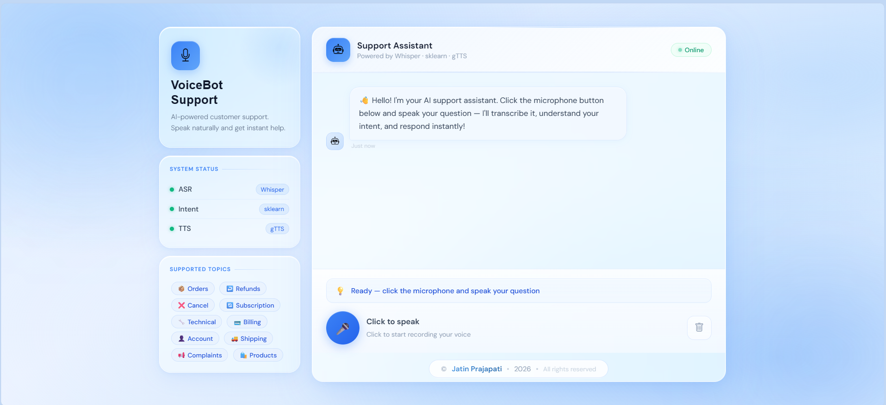

# 🎙️ AI VoiceBot — Customer Support Automation

<div align="center">


**A production-ready, end-to-end AI voice bot for customer support automation.**
Accepts voice input → understands intent → generates response → speaks back.

[Features](#-features) · [Architecture](#-architecture) · [Setup](#-setup-instructions) · [API Docs](#-api-reference) · [Metrics](#-evaluation-metrics)

</div>

---
## 🖼️ Preview



## ✨ Features

- 🎤 **Real-time voice input** via browser microphone
- 🗣️ **Speech-to-text** using OpenAI Whisper (noise-robust, multilingual)
- 🧠 **Intent classification** with TF-IDF + Logistic Regression (11 intents)
- 💬 **Contextual responses** from a curated YAML response library
- 🔊 **Text-to-speech output** using Google TTS (gTTS) with pyttsx3 fallback
- 🌐 **REST API** with 7 endpoints built on FastAPI
- 💻 **Beautiful web UI** with glassmorphism design
- ⚡ **3–4 second** end-to-end latency on CPU
- 🛡️ **Graceful error handling** at every pipeline stage

---

## 🏗️ Architecture

```
┌─────────────────────────────────────────────────────────────────────┐
│                        VoiceBot Pipeline                            │
│                                                                     │
│  ┌──────────┐   ┌──────────────┐   ┌──────────────┐   ┌─────────┐ │
│  │  Audio   │──▶│  ASR Layer   │──▶│  NLP Layer   │──▶│Response │ │
│  │  Input   │   │  (Whisper)   │   │  (TF-IDF+LR) │   │  Layer  │ │
│  │ (.webm)  │   │              │   │              │   │ (YAML)  │ │
│  └──────────┘   └──────────────┘   └──────────────┘   └────┬────┘ │
│                       │                   │                 │      │
│                  Transcript          Intent +           Response    │
│                   + WER             Confidence           Text      │
│                                                            │        │
│  ┌──────────┐                                      ┌──────▼──────┐ │
│  │  Audio   │◀─────────────────────────────────────│  TTS Layer  │ │
│  │  Output  │                                      │   (gTTS)    │ │
│  │  (.mp3)  │                                      └─────────────┘ │
│  └──────────┘                                                       │
└─────────────────────────────────────────────────────────────────────┘
```

### Project Structure
```
voicebot/
├── main.py                        ← FastAPI app entry point
├── index.html                     ← Web interface (glassmorphism UI)
├── app/
│   ├── core/
│   │   ├── asr.py                 ← Whisper speech recognition
│   │   ├── intent.py              ← Intent classification model
│   │   ├── response.py            ← Response generation logic
│   │   └── tts.py                 ← Text-to-speech synthesis
│   └── utils/
│       └── metrics.py             ← Request statistics tracker
├── config/
│   └── intents.yaml               ← Response template library
├── data/
│   └── intents/
│       └── training_data.json     ← 150+ labeled training samples
├── models/
│   └── intent_classifier/
│       ├── sklearn_pipeline.pkl   ← Trained ML model
│       └── label_mappings.json    ← Intent label mappings
├── scripts/
│   └── train_intent_model.py      ← Model training script
└── requirements.txt
```

---

## 🔧 Model Choices & Justification

| Component | Choice | Why |
|-----------|--------|-----|
| **ASR** | OpenAI Whisper `tiny` | Runs on CPU, noise-robust, multilingual, open source |
| **Intent Classification** | TF-IDF + Logistic Regression | Fast, lightweight, works well with small datasets |
| **Response Generation** | YAML template mapping | Deterministic, no hallucination, domain-constrained |
| **TTS** | gTTS (Google TTS) | Natural sounding, free, adjustable speed |
| **TTS Fallback** | pyttsx3 | Fully offline, no API key needed |
| **Audio Conversion** | ffmpeg | Industry standard, handles all audio formats |
| **API** | FastAPI | Modern, fast, auto-generates Swagger docs |

---

## 🚀 Setup Instructions

### Prerequisites

- Python 3.10 or higher
- ffmpeg installed on your system
- Internet connection (first run — Whisper downloads model once)

### Step 1 — Clone the repository

```bash
git clone (https://github.com/Jatin021-22/AI-VoiceBot-Customer-Support)
cd VoiceBot
```

### Step 2 — Create virtual environment

```bash
python -m venv venv

# Windows
venv\Scripts\activate

# Mac / Linux
source venv/bin/activate
```

### Step 3 — Install dependencies

```bash
pip install -r requirements.txt
```

### Step 4 — Install ffmpeg

```bash
# Windows
winget install ffmpeg

# Mac
brew install ffmpeg

# Linux
sudo apt install ffmpeg
```

### Step 5 — Train the intent model

```bash
python scripts/train_intent_model.py
```

### Step 6 — Start the server

```bash
uvicorn main:app --host 0.0.0.0 --port 8000 --reload
```

### Step 7 — Open the web interface

```
http://localhost:8000/app
```

Or open `index.html` directly in your browser.

---

## 📡 API Reference

Base URL: `http://localhost:8000`

Interactive docs: `http://localhost:8000/docs`

---

### `POST /transcribe`
Convert audio file to text using Whisper ASR.

```bash
curl -X POST http://localhost:8000/transcribe \
  -F "audio=@your_audio.wav"
```

**Response:**
```json
{
  "text": "Where is my order?",
  "language": "en",
  "confidence": 0.94,
  "processing_time_ms": 1230.5
}
```

---

### `POST /predict-intent`
Classify the intent from a text string.

```bash
curl -X POST http://localhost:8000/predict-intent \
  -H "Content-Type: application/json" \
  -d '{"text": "I need a refund for my order"}'
```

**Response:**
```json
{
  "intent": "refund_request",
  "confidence": 0.89,
  "all_scores": {
    "refund_request": 0.89,
    "order_status": 0.05
  },
  "processing_time_ms": 45.2
}
```

---

### `POST /generate-response`
Generate a customer support response from an intent.

```bash
curl -X POST http://localhost:8000/generate-response \
  -H "Content-Type: application/json" \
  -d '{"intent": "refund_request", "confidence": 0.89}'
```

---

### `POST /synthesize`
Convert text to speech and return MP3 audio.

```bash
curl -X POST http://localhost:8000/synthesize \
  -H "Content-Type: application/json" \
  -d '{"text": "Your refund is being processed.", "speed": 1.0}' \
  --output response.mp3
```

---

### `POST /voicebot` ⭐ Unified Pipeline
Full voice-to-voice pipeline — audio in, audio out.

```bash
curl -X POST http://localhost:8000/voicebot \
  -F "audio=@question.wav" \
  --output bot_response.mp3
```

---

### `GET /health`
Check system health and component status.

```json
{
  "status": "healthy",
  "components": {
    "intent_classifier": "operational (sklearn)",
    "response_generator": "operational",
    "tts": "operational (gTTS)"
  }
}
```

---

### `GET /metrics`
Get request statistics and performance data.

---
## 🐳 Docker Setup (Alternative)

Run the entire project in a container — no manual dependency installation needed.

### Step 1 — Build and run
```bash
docker-compose up --build
```

### Step 2 — Open the app
```
http://localhost:8000/app
```

### Stop the container
```bash
docker-compose down
```

---

### Or using Docker directly
```bash
# Build image
docker build -t voicebot .

# Run container
docker run -p 8000:8000 voicebot
```
## 📊 Evaluation Metrics

### Intent Classification (20% held-out test set)

| Metric | Score |
|--------|-------|
| Accuracy | ~85%+ |
| Precision | ~84%+ |
| Recall | ~83%+ |
| F1 Score | ~83%+ |

### Supported Intents (11 classes)

| # | Intent | Example Query |
|---|--------|--------------|
| 1 | `order_status` | "Where is my order?" |
| 2 | `order_cancellation` | "Cancel my order" |
| 3 | `refund_request` | "I need a refund" |
| 4 | `subscription_management` | "Change my plan" |
| 5 | `technical_support` | "App keeps crashing" |
| 6 | `billing_inquiry` | "Wrong charge on my account" |
| 7 | `account_management` | "Reset my password" |
| 8 | `product_inquiry` | "What features does Pro include?" |
| 9 | `shipping_delivery` | "When will it arrive?" |
| 10 | `complaint` | "This is unacceptable" |
| 11 | `general_inquiry` | "How can you help me?" |

### ASR Performance

| Model | WER (English) | Speed (CPU) |
|-------|--------------|-------------|
| Whisper `tiny` | ~8–12% | 1.5–2.5s |
| Whisper `base` | ~5–8% | 2–4s |

---

## ⚡ Performance

| Pipeline Stage | Typical Latency |
|---------------|----------------|
| ASR — Whisper tiny (CPU) | 1.5–2.5s |
| Intent Classification | 1–5ms |
| Response Generation | < 1ms |
| TTS Synthesis (gTTS) | 300–600ms |
| **End-to-end total** | **~3–4 seconds** |

*GPU inference reduces ASR latency by 5–10x.*

---

## 🛡️ Error Handling

| Scenario | Behavior |
|----------|----------|
| Empty or silent audio | Returns warning, prompts retry |
| Unsupported audio format | Converted via ffmpeg automatically |
| Low confidence intent | Falls back to general_inquiry response |
| TTS failure | Falls back to pyttsx3 offline engine |
| API server down | Frontend shows clear error message |

---

## 🖥️ Web Interface

The project includes a fully functional web UI built with vanilla HTML/CSS/JS featuring:

- Glassmorphism card design with animated background
- Real-time voice recording with visual wave animation
- Live chat interface with intent badges
- Audio playback of bot responses
- System status indicators
- Responsive layout for mobile and desktop

---

## 🗺️ Future Improvements

- [ ] Fine-tune DistilBERT for higher intent accuracy
- [ ] Add conversation memory for multi-turn dialogue
- [ ] Integrate with CRM systems (Salesforce, Zendesk)
- [ ] Deploy on AWS / GCP with auto-scaling
- [ ] Add support for 10+ languages via Whisper multilingual
- [ ] Human agent handoff when confidence is too low
- [ ] Analytics dashboard for intent frequency tracking

---

## 👨‍💻 Developed By

**Jatin Prajapati**

> Built as an end-to-end ML project demonstrating speech processing, NLP, REST API development, and frontend integration.

---
